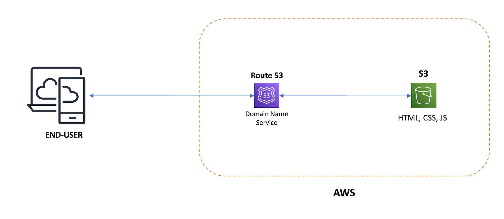

# Static Site Template

THE SOFTWARE IS PROVIDED "AS IS", WITHOUT WARRANTY OF ANY KIND, EXPRESS OR
IMPLIED, INCLUDING BUT NOT LIMITED TO THE WARRANTIES OF MERCHANTABILITY,
FITNESS FOR A PARTICULAR PURPOSE AND NONINFRINGEMENT. IN NO EVENT SHALL THE
AUTHORS OR COPYRIGHT HOLDERS BE LIABLE FOR ANY CLAIM, DAMAGES OR OTHER
LIABILITY, WHETHER IN AN ACTION OF CONTRACT, TORT OR OTHERWISE, ARISING FROM,
OUT OF OR IN CONNECTION WITH THE SOFTWARE OR THE USE OR OTHER DEALINGS IN THE
SOFTWARE.

## Introduction
This repository contains a skeleton framework to create static websites using Bootstrap, Font Awesome and Google fonts. It uses Grunt as the main build tool.

## About

### Built With
- (NodeJS v19)[https://nodejs.org]
- (Grunt CLI 1.4.3)[https://gruntjs.com]
- (Sass 1.55)[https://sass-lang.com]
- (AWS Command Line Interface 2.8.5) [https://aws.amazon.com/cli/]
- (Terraform 1.5.3)[https://www.terraform.io]

Grunt is used as the main build tool, Terraform and the AWS CLI are used to create AWS resources.

Templating is used for the header, navigation and footer, thus eliminating code duplication across html files. Bootstrap and Sass are the CSS framework, Font Awesome for icons and Google fonts for fonts. CSS and Javascript are concatenated and then minified.

## Architecture

One possible way to deploy the website is on Amazon Web Services (AWS) using an S3 bucket to host the site and Route53 for the Domain Name Service entries. This simple architecture is depicted in the diagram below. 

Take note that this is not production ready and is only for example purposes, it is highly recommended to use a content delivery network (CDN) like AWS Cloudfront.




## Getting Started

### Prerequisites
Ensure that you have the AWS CLI installed and configured correctly. Also ensure that you have installed NodeJs and Terraform. Make sure that Sass is installed correctly and can be run from the command line, open a unix bash like terminal and run the following to verify:

```sh
sass --version
```

This should print out the version of sass.

### Create Infrastructure on AWS

Register your domain through AWS Route 53. Once your domain is registered a new Hosted Zone will be created with two default records. There is no need to alter these.

[Terraform](https://www.terraform.io) is used to create the necessary infrastructure on AWS to deploy the site.

The resources created are 2 AWS S3 buckets, and two DNS records on the Hosted Zone for your domain name. Terraform will create an S3 bucket for `yourdomain.com` as well as `www.yourdomain.com` to redirect to `yourdomain.com` and a DNS record for each.

### Steps to Run Terraform

You will need to update your domain name and hosted zone id in the terraform variables file: `terraform.tfvars`.

Change into the `infrastructure` directory and initialize Terraform
```sh
cd infrastructure
terraform init
```

Now run plan to see what changes Terraform will apply.
```sh
terraform plan
```

If you are happy with the changes you can apply them
```sh
terraform apply
```

You can destroy all the resources created if you no longer need them
```sh
terraform destroy
```

Note that DNS propagation can take a while so your website might not be reachable through the domain name until the newly created DNS records have propagated through the system. This can take up to 24h hours but usually takes about an hour or so.

### Build Website

Change into the `website` directory and run the following:
```sh
cd website
npm install
```

Install grunt:
```sh
npm install -g grunt-cli
```

Now run Grunt:
```sh
grunt
```

This will create a folder named `dist` that contains your website files.

### Deploy Site
You can use the AWS command line interface to sync the website to your AWS S3 bucket once you have built the website.

You will need to install the AWS CLI and configure it using your user's access key and secret key. If you don't have these you can create a new user in AWS using the IAM service, ensure to enable programmatic access for the new user.

Once your AWS CLI is setup and configured you can use it to deploy your website to the S3 bucket created by Terraform.

```sh
cd dist
aws s3 sync . s3://yourdomain.com
```

### GitHub Action
A simple GitHub action can be setup to build and deploy the site, you will need to set your AWS user's access key and secret key as repository secrets. Be sure to configure your S3 bucket name.

```
name: Build and Deploy Website to AWS

on:
  push:
    branches: [ main ]

jobs:
  build:
    runs-on: ubuntu-latest

    strategy:
      matrix:
        node-version: [16.x]
    
    steps:
    - uses: actions/checkout@v2

    - name: Use Node.js ${{ matrix.node-version }}
      uses: actions/setup-node@v1
      with:
        node-version: ${{ matrix.node-version }}     

    - name: Build
      run: |
        npm install -g sass
        npm install terser
        npm install
        grunt
    
    - name: Configure AWS Credentials
      uses: aws-actions/configure-aws-credentials@v1
      with:
        aws-access-key-id: ${{ secrets.AWS_ACCESS_KEY_ID }}
        aws-secret-access-key: ${{ secrets.AWS_SECRET_ACCESS_KEY }}
        aws-region: us-east-1

    - name: Deploy static site to S3 bucket
      run:  aws s3 sync ./dist/ s3://your_s3_bucket_name_here
```

## Contributing

Contributions are what make the open source community such an amazing place to learn, inspire, and create. Any contributions you make are **greatly appreciated**.

If you have a suggestion that would make this better, please fork the repo and create a pull request. You can also simply open an issue with the tag "enhancement".
Don't forget to give the project a star! Thanks again!

1. Fork the Project
2. Create your Feature Branch (`git checkout -b feature/AmazingFeature`)
3. Commit your Changes (`git commit -m 'Add some AmazingFeature'`)
4. Push to the Branch (`git push origin feature/AmazingFeature`)
5. Open a Pull Request

## License

Distributed under the MIT License. See `LICENSE.txt` for more information.

Copyright 2021-present Trevor Charles Miller